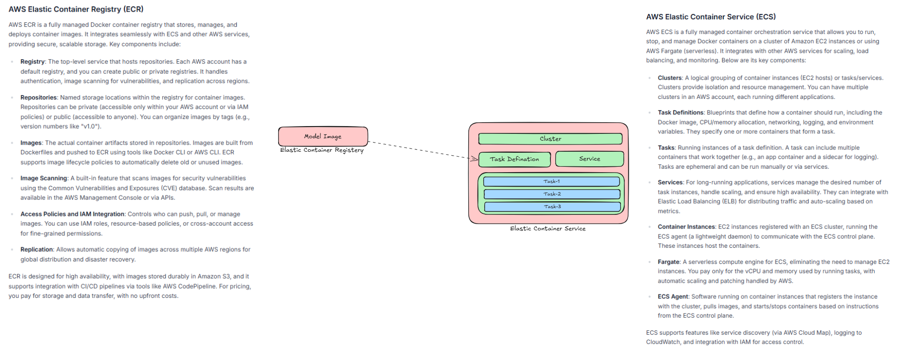

# Ollama Llama Model API Deployment with Docker, ECR, and ECS


This repository provides a complete setup for deploying an Ollama-powered Llama language model as a containerized FastAPI service on AWS. It leverages Docker for containerization, Amazon Elastic Container Registry (ECR) for image storage, and Amazon Elastic Container Service (ECS) for scalable execution, enabling real-time API-based interactions with the model.


---

## 🗂️ Key Files and Components

- **Dockerfile**: Builds a Ubuntu 22.04-based image that installs Ollama, pulls the specified Llama model, and sets up a FastAPI server for API endpoints.

- **api.py**: A FastAPI application that exposes endpoints to send prompts to the Ollama model and receive generated responses.

- **pull_model.sh**: Script to initialize Ollama, download the model (e.g., Llama 2), and prepare it for use.

- **start.sh**: Entrypoint script that starts the Ollama server and launches the FastAPI app.

---

## 🚀 Deployment Workflow

### 1. Build the Docker Image

```bash
docker build -t ollama-api .
```

### 2. Push to ECR
```bash
aws ecr get-login-password --region <your-region> | docker login --username AWS --password-stdin <your-account-id>.dkr.ecr.<your-region>.amazonaws.com
docker tag ollama-api:latest <your-account-id>.dkr.ecr.<your-region>.amazonaws.com/ollama-api:latest
docker push <your-account-id>.dkr.ecr.<your-region>.amazonaws.com/ollama-api:latest
```


### 3. Deploy on ECS

- Create an ECS cluster.

- Define a task definition using the pushed image.

- Set up a service to run the container.

- Expose port 8000 for API access.


### 4. Interact with the API
Send HTTP requests to the deployed service:
```bash
curl -X POST "http://<your-ecs-endpoint(public ip of your task)>/generate" \
     -H "Content-Type: application/json" \
     -d '{"prompt": "Hello, world!"}'
```
<br>

### 🧪 Local Testing
```bash
docker build -t ollama-api .
docker run -p 8000:8000 ollama-api
```

Test the API locally:
```bash
curl -X POST "http://localhost:8000/generate" \
     -H "Content-Type: application/json" \
     -d '{"prompt": "Hello, world!"}'
```
<br>

### 📋Prerequisites
- Docker installed on your machine.
- AWS CLI configured with permissions for ECR and ECS.
- Ollama-compatible model (e.g., Llama 2) — ensure it's publicly available or adjust pull_model.sh for private sources.
<br>


### ⚙️ Customization
- **Model Selection**: Edit pull_model.sh to specify the desired Ollama model (e.g., ollama pull llama2).
- **Environment Variables**: Add variables in the Dockerfile or ECS task definition for ports, model paths, or API settings.
- **Security**: The Dockerfile runs as root by default; consider adding a non-root user for production.
<br>

### 🤝 Contributing
Contributions are welcome! Please open issues for bugs or feature requests, and submit pull requests for improvements. Ensure all changes are tested locally before deployment.
